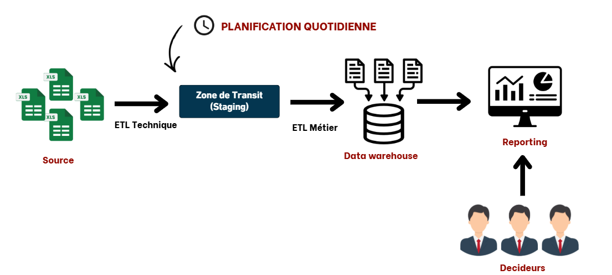
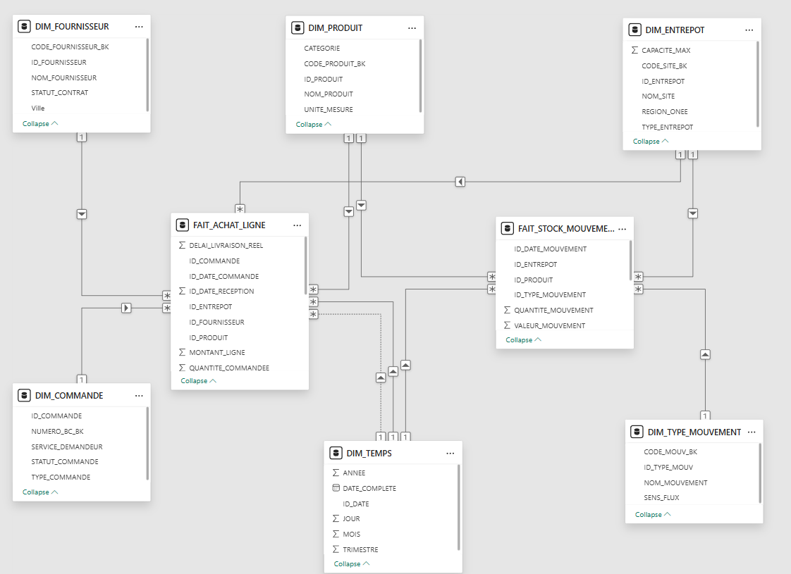
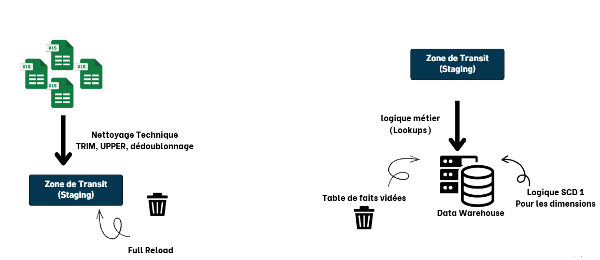
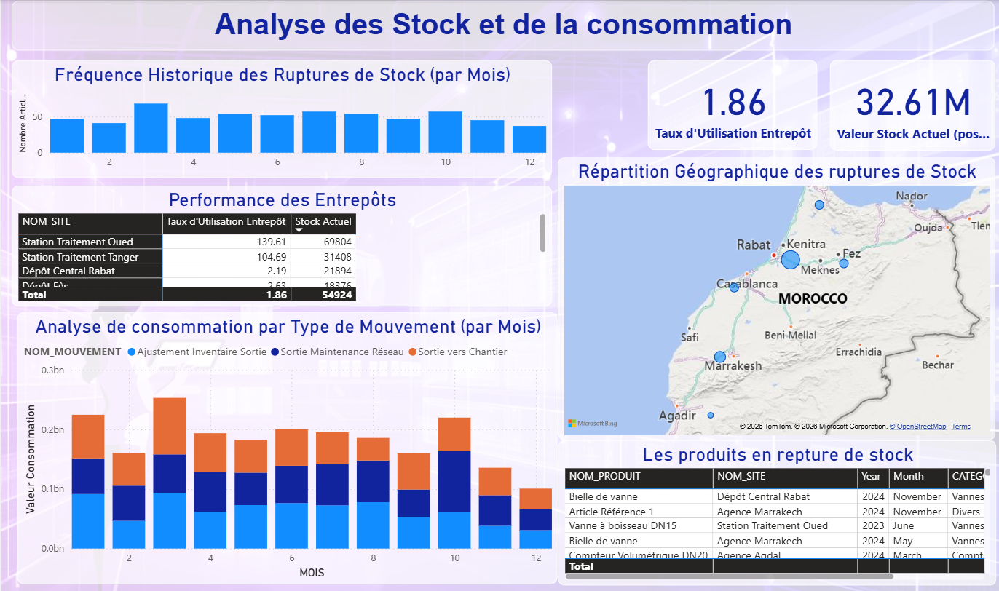
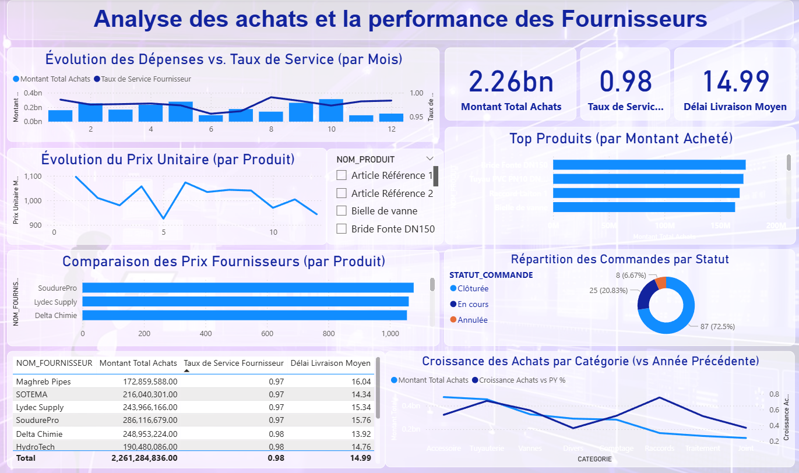

# ⚡ BI System for Purchasing & Inventory Analysis

## 📌 Project Overview
This project was developed as part of my final-year internship at the **Office National de l’Électricité et de l’Eau Potable – Water Branch (ONEE-BO)**.

The objective was to design and implement a **complete Business Intelligence solution** to support decision-making in **purchasing and inventory management**.

The system bridges the gap between **operational ERP data (SAP)** and **strategic analytics**, enabling better visibility, control, and performance monitoring.

---

## 🎯 Business Problem
The existing system faced several limitations:
- Data scattered across multiple sources (Excel exports from SAP)
- Lack of centralized and reliable reporting
- Difficulty in tracking stock movements and purchase performance
- No proactive monitoring of stock-out risks

👉 This project addresses these challenges by building a **centralized and automated decision support system**.

---

## 🏗️ System Architecture

The solution follows a layered Business Intelligence architecture:

### 🔹 Architecture Diagram

### 🔹 Architecture Description
1. **Data Sources**
   - Excel files simulating SAP data (Purchasing, Inventory, Products, Suppliers)

2. **ETL Layer (SSIS)**
   - Data extraction, transformation, and loading
   - Data quality checks and rejection management

3. **Data Warehouse (SQL Server)**
   - Constellation schema modeling
   - Optimized for analytical queries

4. **Visualization Layer (Power BI)**
   - Interactive dashboards
   - KPI tracking and decision support

---

## 🧩 Data Model (Constellation Schema)

### 🔹 Data Model Diagram

### 🔹 Fact Tables
- **Fact_Purchases**
  - Purchase Amount, Quantity, Unit Price

- **Fact_Stock_Movements**
  - Quantity In, Quantity Out, Stock Variation

### 🔹 Dimension Tables
- **Dim_Product** (Product ID, Name, Category)
- **Dim_Orders** (Order ID, Order Type, Order Status)
- **Dim_Supplier** (Supplier ID, Name, Location)
- **Dim_Date** (Date, Month, Year, Quarter)
- **Dim_Warehouse** (Warehouse ID, Region, City)
- **Dim_Movement_Type** (Entry, Exit, Adjustment)

---

## 🔄 ETL Strategy (SSIS)

### 🔹 ETL Workflow Diagram

### 🔹 ETL Process Description

The ETL process was designed following a structured and layered approach to ensure data quality, consistency, and reliability.

#### 1. Technical Data Cleaning (Source Layer)
- Initial preprocessing of source Excel files
- Handling missing values, incorrect formats, and duplicates
- Standardizing column names and data types

👉 This step ensures that only clean and usable data enters the pipeline.

#### 2. Loading into Staging Area
- Cleaned data is loaded into a **staging database**
- Acts as an intermediate layer between sources and the data warehouse
- Preserves raw data for traceability and debugging

#### 3. Business Transformation (Transformation Layer)
- Application of **business rules** using:
  - Lookups (to map dimension keys)
  - Data enrichment and validation
- Ensures data consistency across dimensions and facts

#### 4. Loading into Data Warehouse
- Final structured data is loaded into the Data Warehouse
- Organized using a **constellation schema**

#### 5. Dimension Management (SCD Type 1)
- Dimensions are managed using **Slowly Changing Dimension Type 1**
  - Existing records are overwritten
  - No historical tracking is maintained
  - Chosen for simplicity and performance

#### 🔹 Key Benefits of This Approach
- Clear separation between technical and business processing
- Improved data quality and reliability
- Better maintainability and scalability of the ETL pipeline

---

## 📊 Power BI Dashboards

### 🔹 Dashboard Overview

  

---

### 🔹 Features
- Interactive filtering (region, product, supplier)
- Drill-down analysis
- Real-time KPI monitoring

---

### 🔹 Key KPIs
- Total Purchase Amount
- Stock Levels
- Inventory Turnover
- Stock-out Risk Indicator
- Warehouse Utilization Rate

---

## 🛠️ Technologies Used

- **SQL Server** → Data Warehouse
- **SSIS** → ETL
- **Power BI + DAX** → Visualization
- **Excel** → Data Sources

---

## 🚀 How to Run the Project

1. Execute SQL scripts to create the database
2. Open SSIS project in Visual Studio
3. Update connection strings
4. Run ETL packages
5. Open Power BI file and refresh data
